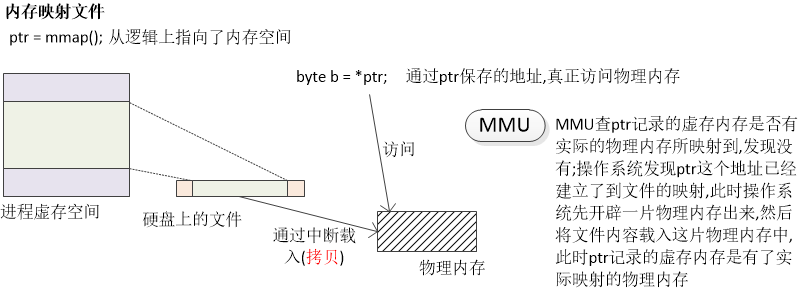

# 程序的结构
- 程序由不同的段构成 (最重要的两个段 : 代码段, 数据段)
    - 程序的静态特征就是指令和数据
    - 程序的动态特征就是执行指令处理数据

- 源程代码到可执行程序文件的对应关系
    `[ File Header ]` : 记录了可执行程序文件相关的基本信息, 之前的静态分析工具多半是借助程序的文件头获取的信息
    `[ .text ]` : 代码段
    `[ .data & .bss ]` : 广义上的数据段, 差异是初始化与否
    
    > 局部变量在栈上分配空间, 栈在后面讲

- 代码段 (.text)
    - 源代码中的可执行语句编译后进入代码段
    - 代码段在有内存管理单元的系统中具有只读属性
    - 代码段的大小在编译结束后就已经固定 (不能动态改变)
    - 代码段中可以包含常量数据 (如 : 常量字符串)

- 数据段 (.data, .bss, .rodata)
    - 数据段用于存放源代码中具有全局生命期的变量
        - .bss
            - 存储未初始化(初始化为0)的变量
        - .data
            - 存储具有非0初始值的变量
        - .rodata
            - 存储const关键字修饰的变量

- 问题
    - 同是全局变量或静态局部变量, 为什么初始化的和未初始化的保存在不同段中?

- 深入理解 .data 和 .bss
    - 程序加载后
        - .bss 段中的所有内存单元被初始化为0
        - 将程序文件中 .data 段相关的初始值写入对应内存单元

    > .bss 段中的变量不用在程序文件中保存初始值, 从而减小可执行程序文件的体积, 并且提高程序的加载效率.

# [<u>实验 - 关键段的分析</u>](vx_attachments/code/13_深入理解程序的结构)

<pre style=" background-color:#fff">
$ gcc -e dt_main test.c -nostartfiles
</pre>

<pre style=" background-color:#fff">
$ objdump -h a.out

a.out:     file format elf64-x86-64

Sections:
Idx Name          Size      VMA               LMA               File off  Algn
  0 .interp       0000001c  0000000000400238  0000000000400238  00000238  2**0
                  CONTENTS, ALLOC, LOAD, READONLY, DATA
  1 .note.gnu.build-id 00000024  0000000000400254  0000000000400254  00000254  2**2
                  CONTENTS, ALLOC, LOAD, READONLY, DATA
  2 .gnu.hash     0000001c  0000000000400278  0000000000400278  00000278  2**3
                  CONTENTS, ALLOC, LOAD, READONLY, DATA
  3 .dynsym       00000000  0000000000400298  0000000000400298  00000298  2**3
                  CONTENTS, ALLOC, LOAD, READONLY, DATA
  4 .dynstr       0000000b  0000000000400298  0000000000400298  00000298  2**0
                  CONTENTS, ALLOC, LOAD, READONLY, DATA
  5 .text         0000000b  00000000004002a3  00000000004002a3  000002a3  2**0
                  CONTENTS, ALLOC, LOAD, READONLY, CODE
  6 .rodata       00000004  00000000004002b0  00000000004002b0  000002b0  2**2
                  CONTENTS, ALLOC, LOAD, READONLY, DATA
  7 .eh_frame_hdr 00000014  00000000004002b4  00000000004002b4  000002b4  2**2
                  CONTENTS, ALLOC, LOAD, READONLY, DATA
  8 .eh_frame     00000038  00000000004002c8  00000000004002c8  000002c8  2**3
                  CONTENTS, ALLOC, LOAD, READONLY, DATA
  9 .dynamic      000000d0  0000000000600f30  0000000000600f30  00000f30  2**3
                  CONTENTS, ALLOC, LOAD, DATA
 10 .data         0000001c  0000000000601000  0000000000601000  00001000  2**3
                  CONTENTS, ALLOC, LOAD, DATA
 11 .bss          00000004  000000000060101c  000000000060101c  0000101c  2**0
                  ALLOC
 12 .comment      00000035  0000000000000000  0000000000000000  0000101c  2**0
                  CONTENTS, READONLY
</pre>
> 此例中 .data 段的大小在64位和32位系统中大小不一样?

查看这个可执行文件中的符号

<pre style=" background-color:#fff">
$ nm a.out
000000000060101c B __bss_start
000000000060101c b <mark>c_no_value</mark>.1836
0000000000601018 d <mark>c_value</mark>.1837
00000000004002a3 T <mark>dt_main</mark>
0000000000600f30 d _DYNAMIC
000000000060101c D _edata
0000000000601020 B _end
00000000004002b0 R <mark>g_c</mark>
0000000000601000 d _GLOBAL_OFFSET_TABLE_
000000000060101d B <mark>g_no_value</mark>
00000000004002b4 r __GNU_EH_FRAME_HDR
0000000000601008 D <mark>g_str</mark>
0000000000601000 D <mark>g_value</mark>
</pre>
> .data 和 .bss 段中的变量的地址是连在一起的

查看 .data 中保存的初始值信息

<pre style=" background-color:#fff">
$ objdump -s -j .data a.out

a.out:     file format elf64-x86-64

Contents of section .data:
 601000 01000000 00000000 442e542e 536f6674  ........D.T.Soft
 601010 77617265 00000000 02000000           ware........
</pre>
> 左边第一列是地址, 后面依次是值
> 此处可和32位系统的打印作对比

查看 .rodata 中保存的初始值信息

<pre style=" background-color:#fff">
$ objdump -s -j .rodata a.out

a.out:     file format elf64-x86-64

Contents of section .rodata:
 4002b0 03000000                             ....
</pre>
> 该地址存储的第一个值为3
# 程序中的栈
- 程序中的栈 (Stack)
    - 程序中栈的本质是一片连续的内存空间
    - SP寄存器作为栈顶 "指针" 实现入栈操作和出栈操作
    
- 栈的深入理解
    - 中断发生时, 栈用于保存寄存器的值
    - 函数调用时, 栈用于保存函数的活动记录 (栈帧信息)
    - 并发编程时, 每一个线程拥有自己独立的栈

# 程序中的堆
- 程序中的堆 (Heap)
    - 堆是一片 "闲置" 的内存空间, 用于提供动态内存分配
    - 堆空间的分配需要函数支持 (malloc)
    - 堆空间在使用结束后需要归还 (free)

# 内存映射段
- 内存映射段 (Memory Mapping Segment)
    - 内核将硬盘文件的内容直接映射到内存映射段(mmap)
    - 动态链接库在可执行程序加载时映射到内存映射段
    - 程序执行时能够创建匿名映射区存放程序数据

- 内存映射文件原理简介
    - 将硬盘上的文件数据逻辑映射到内存中 (零耗时)
    - 通过缺页中断进行文件数据的实际载入 (一次数据拷贝)
        > 缺页中断 : 前面MMU中提到过
    - 映射后的内存的读写就是对文件数据的读写
    

# 实验 - 内存映射文件的原理
- 传统的读文件的方法 (拷贝两次)

- 内存映射文件 (利用中断, 拷贝一次)

# 小结

> 最下面的 0 ~ 0x08048000 : 保留给操作系统使用的
> Heap, Memory Mapping Segment, Stack 的 random offset 随机偏移,是为了安全
