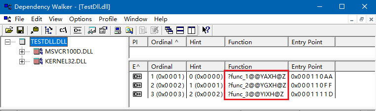

# 函数调用时发生了什么?
- ABI 定义了函数调用时
    - 栈帧的内存布局
    - 栈帧的形成方式
    - 栈帧的销毁方式

    
    > esp (栈顶指针寄存器), 指向当前栈存储区的顶部

 - ebp 是函数调用以及函数返回的核心寄存器
    - ebp 为当前栈帧的基准 (存储上一个栈帧的 ebp 值)
    - 通过 ebp 能够获取返回值地址, 参数, 局部变量, 等

    
    > 右边箭头表示上面是高地址,下面是低地址
    > caller : 函数调用者栈帧的局部; callee : 被调函数栈帧的局部
    > ebp存储方式类似链表, 任意一个节点都保存了下一个节点的地址, 任意一个栈帧都保存了上一个栈帧的基准地址

- Linux 中栈帧布局 (与上面的表格类似)

    
    > 系统的ABI规范规定的这样的存储方式

- 函数调用发生时的细节操作
    - 调用者通过 call 指令调用函数, 将返回地址压入栈中
    - 函数所需要的栈空间大小由编译器确定, 表现为字面常量(汇编代码的)
        > 每一个函数对应的栈帧的大小是不定的, 编译器在编译的时候确定了当前函数所需要的栈空间的大小
    - 函数结束时, leave质量恢复上一个栈帧的 esp 和 ebp
    - 函数返回时, ret 指令将返回地址恢复到 eip(PC) 寄存器

    
    > - `move ebp, esp` : 将ebp赋给esp
    > - `pop ebp` : 将上一个栈帧的ebp pop 给 ebp
    > - eip : 指令寄存器 (将 return address pop 给 eip), 在返回的地方继续执行程序

- 函数调用时的"前言"和"后续" (被高级语言隐藏的两个细节的行为)

    |                  前言                   |              后续               |
    | --------------------------------------- | ------------------------------- |
    | push ebp                                | pop ... |
    | move esp, ebp                           | pop ebx |
    | sub $(SIZE), esp | pop esi |
    | push edi        | pop edi |
    | push esi        | leave                           |
    | push ebx        | ret                             |
    | push ...        |                                 |
    > - 前言和后续的中间, 就是我们用高级语言编写的代码逻辑
    > - 前沿和后续对每个函数来说基本上是一致的, 因此编译器就将这些一致的行为隐藏了
    > - `sub $(SIZE), esp` : 将esp的值做减法, 即esp的值往低地址处移动了, 接下来就是往当前栈帧中写内容了
    > - 前言所做的事情就是为了形成栈帧的, 先确定当前栈帧的基准地址,然后确定当前栈帧的大小
    > - 后续行为, leave就是摧毁当前的栈帧, ret就是真正的函数返回
    > - 灰色部分 : 对每个函数来说,都会使用一些寄存器, 寄存器的数目是有限的, 因此对于一个函数而言, 使用寄存器之前, 应该将寄存器原先的值保存(push)下来(保存在当前栈帧中), 栈帧销毁时,恢复(pop)这些寄存器的值
    > - 这里对于通用寄存器 edi, esi, ebx 的 push(pop)操作并不是压栈(出栈)操作; 而是表示将对应寄存器的值存入栈帧中(从栈帧中取出), 存取的顺序正好相反.

- GDB 小贴士 : info frame 命令输出的阅读

    
    > 红框中内容 : 参数列表和局变量的列表都可以通过红框中的地址或得到, 这个地址就是ebp(栈帧基准地址)

# [<u>编程实验 - 函数栈帧结构初探</u>](vx_attachments/code/15_缔造程序兼容的合约-下)
<pre style=" background-color:#fff">
$ gdb
GNU gdb (Ubuntu 7.11.1-0ubuntu1~16.5) 7.11.1
Copyright (C) 2016 Free Software Foundation, Inc.
License GPLv3+: GNU GPL version 3 or later <http://gnu.org/licenses/gpl.html>
This is free software: you are free to change and redistribute it.
There is NO WARRANTY, to the extent permitted by law.  Type "show copying"
and "show warranty" for details.
This GDB was configured as "x86_64-linux-gnu".
Type "show configuration" for configuration details.
For bug reporting instructions, please see:
<http://www.gnu.org/software/gdb/bugs/>.
Find the GDB manual and other documentation resources online at:
<http://www.gnu.org/software/gdb/documentation/>.
For help, type "help".
Type "apropos word" to search for commands related to "word".
(gdb) <mark>shell gcc -g -m32 frame.c</mark>
(gdb) <mark>file a.out</mark>
Reading symbols from a.out...done.
(gdb) <mark>start</mark>
Temporary breakpoint 1 at 0x80486fe: file frame.c, line 53.
Starting program: /mnt/hgfs/computer_fundamental_code/15_缔造程序兼容的合约-下/a.out

Temporary breakpoint 1, main () at frame.c:53
53      {
(gdb) <mark>break frame.c:35</mark>
Breakpoint 2 at 0x80485ad: file frame.c, line 35.
(gdb) <mark>info breakpoints</mark>
Num     Type           Disp Enb Address    What
2       breakpoint     keep y   0x080485ad in test at frame.c:35
(gdb) <mark>continue</mark>
Continuing.
main() :
ebp = 0xffffd408
previous ebp = 0x0
return address = 0xf7e1a637
previous esp = 0xffffd410
esp = 0xffffd3f0
&ebp = 0xffffd3f4
&esp = 0xffffd3f8
func() :
ebp = 0xffffd3e8
previous ebp = 0xffffd408
return address = 0x80487cc
previous esp = 0xffffd3f0
esp = 0xffffd3c0
&ebp = 0xffffd3d4
&esp = 0xffffd3d8
&a = 0xffffd3cc
&b = 0xffffd3d0
test() :
ebp = 0xffffd3a8
previous ebp = 0xffffd3e8
return address = 0x80486d6
previous esp = 0xffffd3b0
esp = 0xffffd390
&ebp = 0xffffd394
&esp = 0xffffd398
&a = 0xffffd3b0
&b = 0xffffd3b4
&c = 0xffffd390

Breakpoint 2, test (a=1, b=2) at frame.c:35
35      }
(gdb) <mark>info frame</mark>
Stack level 0, frame at 0xffffd3b0:
 eip = 0x80485ad in test (frame.c:35); saved eip = 0x80486d6
 called by frame at 0xffffd3f0
 source language c.
 Arglist at 0xffffd3a8, args: a=1, b=2
 Locals at 0xffffd3a8, Previous frame's sp is 0xffffd3b0
 Saved registers:
  ebp at 0xffffd3a8, eip at 0xffffd3ac
(gdb) <mark>x /1wx 0xffffd3ac</mark>
0xffffd3ac:     0x080486d6
(gdb) <mark>x /1wx 0xffffd3b0</mark>
0xffffd3b0:     0x00000001
(gdb) <mark>x /1wx 0xffffd3b4</mark>
0xffffd3b4:     0x00000002
</pre>

反汇编查看, 可看到函数调用时的细节行为 [frame.s](vx_attachments/code/15_缔造程序兼容的合约-下/disassemble/frame.s)

<pre style=" background-color:#fff">
(gdb) <mark>shell objdump -S a.out > disassemble/frame.s</mark>
</pre>

# 调用约定(ABI规范的一部分)
- 问题
    - 函数调用时,参数如何入栈?
    - 函数返回时, 返回值在哪里?

- C语言默认使用的调用约定 (`__cdecl__`)
    - 调用函数时, 参数从右向左入栈
    - 函数返回时, 函数的调用者负责将参数弹出栈
    - 函数返回值保存在 eax 寄存器中

- 其他各种调用约定

|    调用约定    |              意义              |                   备注                    |
| -------------- | ------------------------------ | ----------------------------------------- |
| `__stdcall__`  | 1. 参数从右向左入栈              |                                           |
|                | 2. 被调函数清理栈中的参数(不同点) |                                           |
|                | 3. 返回值保存在eax寄存器中       |                                           |
| `__fastcall__` | 1. 使用ecx和edx传递前两个参数    | 快速调用主要快速在有两个参数是使用寄存器传递的 |
|                | 2. 剩下的参数从右向左入栈        | 相比用栈传递,快得多                         |
|                | 3. 被调函数清理栈中的参数        | 参数若多于两个,还是用栈来传递                |
|                | 4. 返回值保存在eax寄存器中       |                                           |
| `__thiscall__` | 1.C++ 成员函数的调用约定         | 如果参数确定(当前成员函数)                   |
|                | 2. 参数从右至左的方式入栈        | ● this 指针存放于ECX寄存器                  |
|                | 3. 返回值保存在eax寄存器中       | ● 函数自身清理栈中的参数                    |
|                |                                | 如果参数不确定(当前成员函数)                 |
|                |                                | ● this指针在所有参数入栈后再入栈             |
|                |                                | ● 调用者清理栈中的参数                      |

- 一些注意事项
    - 只有使用了 `__cdecl__` 的函数支持可变参数定义
    - 当类的成员函数为可变参数时, 调用约定自动变为 `__cdecl__`
    - 调用约定定义了函数被编译后对应的最终符号名
        > 这一点经常成为错误的来源, 我们在开发 共享库 或 动态链接库 的时候, 若忽略上面一点, 则会导致动态链接库中的函数无法成功的调用

# [<u>实验 - 函数调用约定</u>](vx_attachments/code/15_缔造程序兼容的合约-下)

## 证明返回值是通过eax寄存器传递的
<pre style=" background-color:#fff">
$ gcc -g -m32 convention.c
$ gdb a.out
GNU gdb (Ubuntu 7.11.1-0ubuntu1~16.5) 7.11.1
Copyright (C) 2016 Free Software Foundation, Inc.
License GPLv3+: GNU GPL version 3 or later <http://gnu.org/licenses/gpl.html>
This is free software: you are free to change and redistribute it.
There is NO WARRANTY, to the extent permitted by law.  Type "show copying"
and "show warranty" for details.
This GDB was configured as "x86_64-linux-gnu".
Type "show configuration" for configuration details.
For bug reporting instructions, please see:
<http://www.gnu.org/software/gdb/bugs/>.
Find the GDB manual and other documentation resources online at:
<http://www.gnu.org/software/gdb/documentation/>.
For help, type "help".
Type "apropos word" to search for commands related to "word"...
Reading symbols from a.out...done.
(gdb) start
Temporary breakpoint 1 at 0x8048448: file convention.c, line 22.
Starting program: /mnt/hgfs/computer_fundamental_code/15_缔造程序兼容的合约-下/a.out

Temporary breakpoint 1, main () at convention.c:22
22          int r = test(1, 2, 3);
(gdb) break convention.c:6
Breakpoint 2 at 0x804841b: file convention.c, line 6.
(gdb) continue
Continuing.

Breakpoint 2, test (a=1, b=2, c=3) at convention.c:6
6       }
(gdb) info registers
eax            0x6      6    // 返回值
ecx            0xffffd420       -11232
edx            0x3      3
ebx            0x0      0
esp            0xffffd3dc       0xffffd3dc
ebp            0xffffd3dc       0xffffd3dc
esi            0xf7fb2000       -134537216
edi            0xf7fb2000       -134537216
eip            0x804841b        0x804841b <test+16>
eflags         0x206    [ PF IF ]
cs             0x23     35
ss             0x2b     43
ds             0x2b     43
es             0x2b     43
fs             0x0      0
gs             0x63     99
(gdb) continue
Continuing.
r = 6
[Inferior 1 (process 2256) exited normally]
(gdb) quit
</pre>

反汇编查看返回值赋值 [convention.s](vx_attachments/code/15_缔造程序兼容的合约-下/disassemble/convention.s)

<pre style=" background-color:#fff">
$ objdump -s a.out > disassemble/convention.s
</pre>

调用完test函数, 将eax赋值给0x1c地址

<pre style=" background-color:#fff">
188: 804840c:	e8 b3 ff ff ff       	call   80483c4 <test>
189: 8048411:	89 44 24 1c          	mov    %eax,0x1c(%esp)
</pre>

证明0x1c地址对应的是r变量的地址

<pre style=" background-color:#fff">
$ gdb a.out
GNU gdb (GDB) 7.2-ubuntu
Copyright (C) 2010 Free Software Foundation, Inc.
License GPLv3+: GNU GPL version 3 or later <http://gnu.org/licenses/gpl.html>
This is free software: you are free to change and redistribute it.
There is NO WARRANTY, to the extent permitted by law.  Type "show copying"
and "show warranty" for details.
This GDB was configured as "i686-linux-gnu".
For bug reporting instructions, please see:
<http://www.gnu.org/software/gdb/bugs/>...
Reading symbols from /mnt/hgfs/code/15_缔造程序兼容的合约-下/a.out...done.
(gdb) start
Temporary breakpoint 1 at 0x80483f5: file convention.c, line 22.
Starting program: /mnt/hgfs/code/15_缔造程序兼容的合约-下/a.out

Temporary breakpoint 1, main () at convention.c:22
22          int r = test(1, 2, 3);
(gdb) print /x &r    // 打印r的地址
$1 = 0xbffff59c
(gdb) info registers
eax            0xbffff654       -1073744300    // 调用前eax是个随机值
ecx            0x80796019       -2139529191
edx            0x1      1
ebx            0x287ff4 2654196
esp            0xbffff580       0xbffff580    // 0xbffff580 + 0x1c = 0xbffff59c
ebp            0xbffff5a8       0xbffff5a8
esi            0x0      0
edi            0x0      0
eip            0x80483f5        0x80483f5 <main+9>
eflags         0x282    [ SF IF ]
cs             0x73     115
ss             0x7b     123
ds             0x7b     123
es             0x7b     123
fs             0x0      0
gs             0x33     51
(gdb) next
24          printf("r = %d\n", r);
(gdb) info registers
eax            0x6      6                // 调用后, eax寄存器的值变为了6
ecx            0x80796019       -2139529191
edx            0x1      1
ebx            0x287ff4 2654196
esp            0xbffff580       0xbffff580
ebp            0xbffff5a8       0xbffff5a8
esi            0x0      0
edi            0x0      0
eip            0x8048415        0x8048415 <main+41>
eflags         0x206    [ PF IF ]
cs             0x73     115
ss             0x7b     123
ds             0x7b     123
es             0x7b     123
fs             0x0      0
gs             0x33     51
(gdb)
</pre>

## 证明调用约定定义了函数被编译后对应的最终符号名
查看上面生成的汇编 [convention.s](vx_attachments/code/15_缔造程序兼容的合约-下/disassemble/convention.s)
空函数体编译得到的只有前言和后续
发现不同的调用约定, 前言和后续有所不同

<pre style=" background-color:#fff">
void __attribute__((__cdecl__)) func_1(int i)
{
 80483d5:	55                   	push   %ebp
 80483d6:	89 e5                	mov    %esp,%ebp
}
 80483d8:	5d                   	pop    %ebp
 80483d9:	c3                   	ret

080483da <func_2>:

void __attribute__((__stdcall__)) func_2(int i)
{
 80483da:	55                   	push   %ebp
 80483db:	89 e5                	mov    %esp,%ebp
}
 80483dd:	5d                   	pop    %ebp
 80483de:	c2 04 00             	ret    $0x4

080483e1 <func_3>:

void __attribute__((__fastcall__)) func_3(int i)
{
 80483e1:	55                   	push   %ebp
 80483e2:	89 e5                	mov    %esp,%ebp
 80483e4:	83 ec 04             	sub    $0x4,%esp
 80483e7:	89 4d fc             	mov    %ecx,-0x4(%ebp)
}
 80483ea:	c9                   	leave
 80483eb:	c3                   	ret
</pre>
> 调用约定决定了函数调用时的细节行为

nm 查看符号, 发现在Linux下,调用约定并未影响函数名

<pre style=" background-color:#fff">
$ nm a.out
08049f28 d _DYNAMIC
08049ff4 d _GLOBAL_OFFSET_TABLE_
080484fc R _IO_stdin_used
         w _Jv_RegisterClasses
08049f18 d __CTOR_END__
08049f14 d __CTOR_LIST__
08049f20 D __DTOR_END__
08049f1c d __DTOR_LIST__
08048508 r __FRAME_END__
08049f24 d __JCR_END__
08049f24 d __JCR_LIST__
0804a014 A __bss_start
0804a00c D __data_start
080484b0 t __do_global_ctors_aux
08048340 t __do_global_dtors_aux
0804a010 D __dso_handle
         w __gmon_start__
080484aa T __i686.get_pc_thunk.bx
08049f14 d __init_array_end
08049f14 d __init_array_start
08048440 T __libc_csu_fini
08048450 T __libc_csu_init
         U __libc_start_main@@GLIBC_2.0
0804a014 A _edata
0804a01c A _end
080484dc T _fini
080484f8 R _fp_hw
08048294 T _init
08048310 T _start
0804a014 b completed.7065
0804a00c W data_start
0804a018 b dtor_idx.7067
080483a0 t frame_dummy
080483d5 T func_1
080483da T func_2
080483e1 T func_3
080483ec T main
         U printf@@GLIBC_2.0
080483c4 T test
</pre>

换一种方式查看, 以c++方式编译文件,查看
发现函数对应的符号名在原始的函数名上做了扩展, 并且这个扩展是相同的

<pre style=" background-color:#fff">
$ g++ -g convention.cpp -o cpp.out
$ nm cpp.out
08049f10 d _DYNAMIC
08049ff4 d _GLOBAL_OFFSET_TABLE_
080485bc R _IO_stdin_used
         w _Jv_RegisterClasses
08048494 T _Z4testiii
080484a5 T _Z6func_1i
080484aa T _Z6func_2i
080484b1 T _Z6func_3i
08049f00 d __CTOR_END__
08049efc d __CTOR_LIST__
08049f08 D __DTOR_END__
08049f04 d __DTOR_LIST__
080486a4 r __FRAME_END__
08049f0c d __JCR_END__
08049f0c d __JCR_LIST__
0804a018 A __bss_start
0804a010 D __data_start
08048570 t __do_global_ctors_aux
08048410 t __do_global_dtors_aux
0804a014 D __dso_handle
         w __gmon_start__
         U __gxx_personality_v0@@CXXABI_1.3
0804856a T __i686.get_pc_thunk.bx
08049efc d __init_array_end
08049efc d __init_array_start
08048500 T __libc_csu_fini
08048510 T __libc_csu_init
         U __libc_start_main@@GLIBC_2.0
0804a018 A _edata
0804a020 A _end
0804859c T _fini
080485b8 R _fp_hw
08048360 T _init
080483e0 T _start
0804a018 b completed.7065
0804a010 W data_start
0804a01c b dtor_idx.7067
08048470 t frame_dummy
080484bc T main
         U printf@@GLIBC_2.0
</pre>

最终符号名在开发共享库或动态链接库时影响是非常明显, 换一种方式验证
windows上用vs2010创建一个动态库
文件->新建->项目->win32->win32 项目->OK->NEXT->选择DLL,勾选"导出符号"->finish
把实验中不同调用约定的3个函数拷贝过来
查看符号是不一样的

> depends软件右键切换显示函数名或符号

# 结构体函数返回值
- 问题
    - 当返回值类型为结构体时, 如何将值返回到调用函数中 ?
        > 很明显只能通过栈, 但具体是怎么做的呢?

- 结构体类型的返回值
    - 函数调用时, 接收返回值的变量地址需要入栈
    - 被调函数直接通过变量地址拷贝返回值
    - 函数返回值用于初始化与赋值对应的过程不同

- 函数返回值初始化变量

    

- 函数返回值给变量赋值

    

# [<u>实验 - 结构体函数返回值</u>](vx_attachments/code/15_缔造程序兼容的合约-下)

## 函数返回值初始化变量
<pre style=" background-color:#fff">
$ gcc -g return.c
$ gdb a.out
GNU gdb (GDB) 7.2-ubuntu
Copyright (C) 2010 Free Software Foundation, Inc.
License GPLv3+: GNU GPL version 3 or later <http://gnu.org/licenses/gpl.html>
This is free software: you are free to change and redistribute it.
There is NO WARRANTY, to the extent permitted by law.  Type "show copying"
and "show warranty" for details.
This GDB was configured as "i686-linux-gnu".
For bug reporting instructions, please see:
<http://www.gnu.org/software/gdb/bugs/>...
Reading symbols from /mnt/hgfs/code/15_缔造程序兼容的合约-下/a.out...done.
(gdb) start
Temporary breakpoint 1 at 0x804854d: file return.c, line 48.
Starting program: /mnt/hgfs/code/15_缔造程序兼容的合约-下/a.out

Temporary breakpoint 1, main () at return.c:48
48          h();
(gdb) break return.c:21
Breakpoint 2 at 0x804841a: file return.c, line 21.
(gdb) continue
Continuing.
f() : &st = 0xbffff554

Breakpoint 2, f (x=4, y=5, z=6) at return.c:21
21      }
</pre>

证明 h()函数中的 st 的地址已经传递到栈上了

<pre style=" background-color:#fff">
(gdb) backtrace    // 查看函数调用栈
#0  f (x=4, y=5, z=6) at return.c:21
#1  0x080484f2 in h () at return.c:38
#2  0x08048552 in main () at return.c:48
(gdb) frame 1        // 切换到h() 函数的上下文中
#1  0x080484f2 in h () at return.c:38
38          struct ST st = f(4, 5, 6);
(gdb) info frame    // 打印当前函数的栈帧
Stack level 1, frame at 0xbffff5a0:
 eip = 0x80484f2 in h (return.c:38); saved eip 0x8048552
 called by frame at 0xbffff5b0, caller of frame at 0xbffff570
 source language c.
 Arglist at 0xbffff598, args:
 Locals at 0xbffff598, Previous frame's sp is 0xbffff5a0
 Saved registers:
  ebp at 0xbffff598, eip at 0xbffff59c
(gdb) print /x &st    // 打印变量st的地址
$1 = 0xbffff584
(gdb) frame 0        // 将上下文切换回f()函数
#0  f (x=4, y=5, z=6) at return.c:21
21      }
(gdb) info frame    // 打印栈帧信息
Stack level 0, frame at 0xbffff570:
 eip = 0x804841a in f (return.c:21); saved eip 0x80484f2
 called by frame at 0xbffff5a0
 source language c.
 Arglist at 0xbffff568, args: x=4, y=5, z=6                            // ebp保存的地址
 Locals at 0xbffff568, Previous frame's sp is 0xbffff570
 Saved registers:
  ebx at 0xbffff564, ebp at 0xbffff568, eip at 0xbffff56c
(gdb) x /1wx 0xbffff570        // 查看偏移处 (ebp保存的地址 + 8) 是否有st的地址
0xbffff570:     0xbffff584       // 与 h() 中 st 的地址一致
(gdb)
</pre>

反汇编查看 [return.s](vx_attachments/code/15_缔造程序兼容的合约-下/disassemble/return.s)

<pre style=" background-color:#fff">
$ objdump -S a.out > disassemble/return.s
</pre>

## 函数返回值给变量赋值
<pre style=" background-color:#fff">
(gdb) continue
Continuing.
h() : &st = 0xbffff584
h() : st.x = 4
h() : st.y = 5
h() : st.z = 6
g() : &st = 0xbffff584
f() : &st = 0xbffff544

Breakpoint 2, f (x=1, y=2, z=3) at return.c:21
21      }
(gdb) backtrace        // 查看函数调用栈
#0  f (x=1, y=2, z=3) at return.c:21
#1  0x08048476 in g () at return.c:29
#2  0x08048557 in main () at return.c:49
</pre>

查看入栈的地址是不是g()函数中st变量的地址

<pre style=" background-color:#fff">
(gdb) info frame        // 打印栈帧信息
Stack level 0, frame at 0xbffff560:
 eip = 0x804841a in f (return.c:21); saved eip 0x8048476
 called by frame at 0xbffff5a0
 source language c.
 Arglist at 0xbffff558, args: x=1, y=2, z=3 // ebp寄存器的值, +8就是入栈的局部变量的地址
 Locals at 0xbffff558, Previous frame's sp is 0xbffff560
 Saved registers:
  ebx at 0xbffff554, ebp at 0xbffff558, eip at 0xbffff55c
(gdb) x /1wx 0xbffff560
0xbffff560:     0xbffff570    // 与 g() 中 st 的地址不一致, 改地址是临时变量的地址
(gdb)
</pre>

反汇编查看 [return.s](vx_attachments/code/15_缔造程序兼容的合约-下/disassemble/return.s)

> 因此, 用函数返回值初始化变量的效率要高一些

# 小结
- 栈帧是函数调用时形成的链式内存结构
- ebp 是构成栈帧的核心基准寄存器
- 调用约定决定了函数调用时的细节行为
- 基础数据类型的返回值通过 eax 传递
- 结构体类型的返回值通过内存拷贝完成
