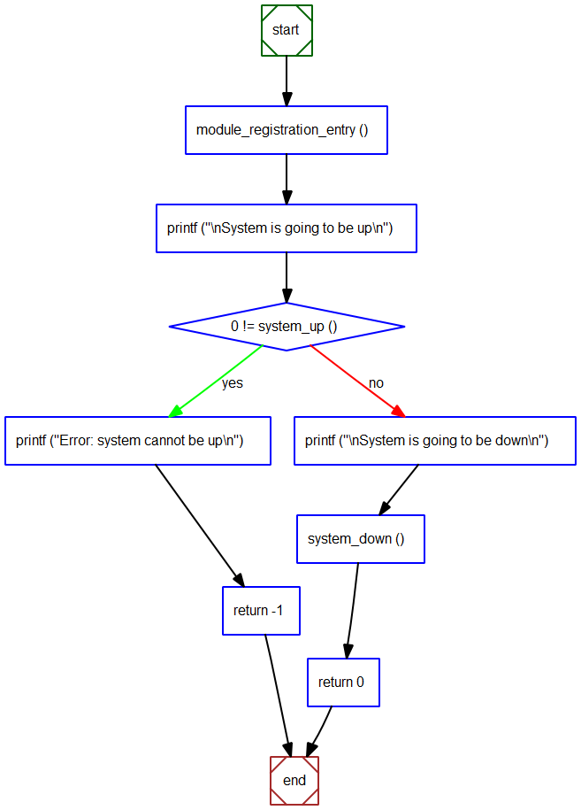

# 系统模块管理的设计
- 系统模块化设计
    - 将系统中<font color=red>有关联的部分组合在一起</font>, 构成具有特定功能的子系统
    - <font color=#d0d>模块的内部组成具有较强的耦合性</font>, 模块本身具有一定通用性
    - <font color=blue>不同的模块间可以进行相互组合与依赖</font>, 进而构成不同的产品

- 模块化设计

    

- 模块化设计示例

    

- 模块的管理
    - 各个模块间需要相互依赖, 进而完成产品功能
    - 根据依赖关系能够将模块分为不同的层

        

- 模块间的分层
    - 硬件层, 系统层, 平台层, 框架层, 应用层

    

- 模块的分级 (更细的设计粒度)
    - 同一层中的模块根据依赖关系能够继续分级

    

- 分层与分级的意义
    - <font color=blue>模块间的依赖关系决定了初始化的前后顺序</font>
    - <font color=blue>被依赖的模块必须先初始化</font> (<font color=red>底层先于上层初始化</font>)
        - 如 :
            - 硬件层模块先于系统层模块初始化
            - 框架层模块先于应用层模块初始化

- 系统架构示例一

    

- 系统架构示例二 (商场收银系统的架构图)

    

# 思考
- 设计时需要思考的问题
    - <font color=blue>如何在代码中定义模块 ?</font>
    - <font color=blue>如何定义模块的层级关系 (依赖关系) ?</font>
    - <font color=blue>如何确定模块的初始化顺序 ?</font>

- 模块的定义
    ```c
    typedef enum {
        MODULE_MODULE,        // for module management
        MODULE_INTERRUPT,     // for interrupt management
        MODULE_DEVICE,        // for device management
        MODULE_CLOCK,         // for clock management
        MODULE_CONSOLE,       // for device of console
        MODULE_CTRLC,         // for handling Ctrl+C on Linux/Cygwin
        MODULE_FLASH,         // for device of flash
        MODULE_TIMER,         // for timer namagement
        MODULE_TASK,          // for task
        MODULE_SYNC,          // for task sync object management
        MODULE_SEMAPHORE,     // for semaphore management
        MODULE_MUTEX,         // for mutex management
        MODULE_QUEUE,         // for queue management
        MODULE_HEAP,          // for heap management
        MODULE_MPOOL,         // for memory pool management

        // ...

    } module_t;
    ```

- 模块的描述及组织方式
    ```c
    typedef struct {
        dll_node_t node_;            // 链表节点
        const char *p_name_;         // 模块名
        module_callback_t callback_; // 模块回调函数, 用于接收消息
        bool is_registered_;         // 注册标记
    } module_init_t;
    ```
    

- 层级关系的定义
    ```c
    typedef enum {
        LEVEL_FIRST,
        // ...

        // for platform layer
        PLARFORM_LEVEL0,
        // ...
        PLARFORM_LEVEL7,

        // for framework layer
        FRAMEWORK_LEVEL0,
        // ...
        FRAMEWORK_LEVEL7,

        // for application layer
        APPLICATION_LEVEL0,
        // ...
        APPLICATION_LEVEL7,

        LEVEL_COUNT,
        LEVEL_LAST = (LEVEL_COUNT - 1)
    } init_level_t;
    ```

- 状态设计
    ```c
    typedef enum {
        STATE_INITIALIZING,
        STATE_UP,
        STATE_DOWN,
        STATE_DESTROYING
    } system_state_t;
    ```
    
    > 回调函数中切换状态, 回调函数每接收一个消息,切换一个状态

- 模块的初始化

    

- 模块的销毁

    

- 实现要点
    - 每一个模块对应一个ID和一个结构体变量 (`module_init_t`)
    - 模块需要注册后才能被初始化 (`module_register`)
    - 模块提供一个回调函数 (`module_callback_t`) 用于接收事件
    - <font color=blue>所有的模块根据层级关系组织于不同链表中</font>
        - <font color=blue>同一个链表中的模块没有依赖关系</font> (同一级的关系)
        - <font color=blue>整个系统从最底层(最上层)的模块开始进行初始化(销毁)</font>

# [<u>实验 - 模块的组织,初始化与销毁 - 源码分析</u>](code/21_系统模块管理的设计)
module.c module.h : 用于表达管理模块, 用于注册模块,给模块发消息
dll.c dll.h : 双向链表, 用于组织模块
errmod.h error.c error.h : 用于定义错误标识
primitive.h 定义使用到的;类型


# 小结
- 模块设计是要遵从<font color=#d0d>强内聚弱耦合</font>的原则
- 模块之间可以<font color=red>相互依赖</font>, 并进行模块<font color=blue>层级的划分</font>
- 模块管理是为了系统中各个模块的有序启动和停止
- <font color=blue>模块设计时需要考虑资源的分配与释放问题</font>
