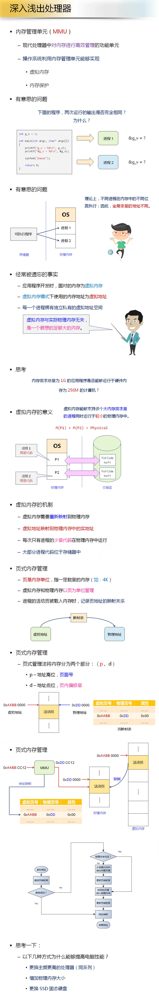

```c
#include <stdio.h>
#include <stdlib.h>

int g_v = 1;

int main(int argc, char ** argv[])
{
	printf("g_v = %d\n", g_v);
	printf("&g_v = %p\n", &g_v);

	//system("pause");
	getchar();

	return 0;
}
```
