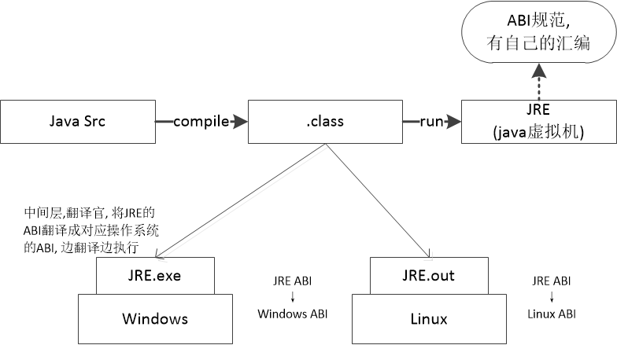
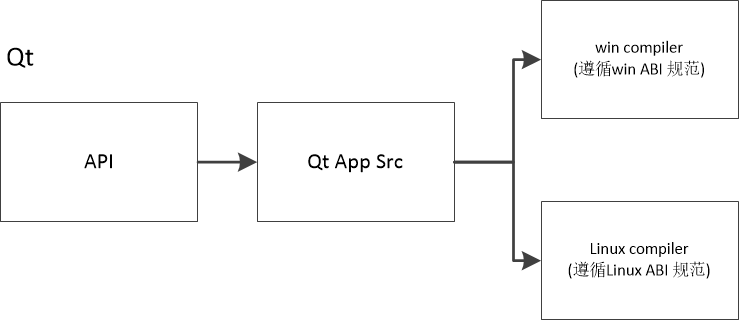

# 缔造程序兼容的合约
- 什么是 ABI (Aplication Binary Interface) ?
    - <font color=blue>应用程序二进制接口</font>
        - 数据类型的大小, 数据对齐方式
        - 函数调用发生时的调用约定
        - 系统调用的编号, 以及进行系统调用的方式
        - 目标文件的二进制格式, 程序库格式, 等等

- 什么是EABI (Embedded Aplication Binary Interface) ?
    - <font color=blue>嵌入式应用程序二进制接口</font>
        - <font color=red>针对嵌入式平台的ABI规范</font>
            - 可链接目标代码以及可执行文件格式的二进制规范
            - 编译链接工具的基础规范, 函数调用规范, 调试格式规范, 等
            - EABI 与 ABI 的<font color=red>主要区别</font>是应用程序代码中允许使用特权指令

- ABI
    - <font color=blue>广义上</font> ABI 的概念
        - <font color=blue>泛指</font>应用程序在二进制层面应该遵循的规范
    - <font color=red>狭义上</font> ABI 的概念
        - <font color=red>特指</font>
            - 某个具体硬件平台的 ABI 规范文档
            - 某个具体操作系统平台的 ABI 规范文档
            - 某个具体虚拟机平台的 ABI 规范文档

- ABI 规范示例
    - 为什么下面的代码能够以0作为退出码结束程序运行?
        ```c
        asm volatile (
            "movl $1, %eax\n"    // #1 → sys_exit
            "movl $0, %ebx\n"    // exit code
            "int $0x80    \n");  // call sys_exit(0)
        ```
        > 这是Linux ABI 规范规定的方式

- 问题 : <font color=blue>ABI</font> 和 <font color=red>API</font> 有什么不同 ?
    - ABI 和 API 是不同层面的规范
        - ABI 是二进制层面的规范
        - API 是源代码层面的规范
    - ABI 和 API 没有直接联系
        - 遵循相同 ABI 的系统, 所提供的 API 可能不同
        - 所提供 API 相同的系统, 遵循的 ABI 可能不同

# 实验 - ABI 实例分析 跨平台程序原理
- JAVA 跨平台原理 : 编译一次, 到处运行

- QT 跨平台原理 : 一次编写, 到处编译

# ABI 定义了基础数据类型的大小
- ABI 定义了基础数据类型的大小

    |                |         基础数据类型         | 大小 |
    | -------------- | --------------------------- | --- |
    | Byte / UByte   | signed / unsigned char      | 1    |
    | Short / UShort | signed / unsigned short     | 2    |
    | Int / UInt     | signed / unsigned int       | 4    |
    | Long / ULong   | signed / unsigned long long | 8    |
    | Float          | float                       | 4    |
    | Double         | double                      | 8    |
    | Pointer        | void *                      | 4    |
    > x86平台 ABI 规范中的基础类型
    > 不同平台对于相同的类型定义也许是不同的, 比如 : java 平台的 char 2个字节, x86平台的 char 1个字节

- ABI vs 移植性
    

- ABI 定义了结构体 / 联合体的字节对齐方式
    

# 实验 - 位域的不同存储方式[^1]
- linux 下运行

<pre style=" background-color:#fff">
$ gcc bit_field.c
$ ./a.out
sizeof = 12
FF03FFFF
1FF01FF
FF
</pre>

- Windows 下运行
打开vs2010的命令行`Visual Studio x64 Win64 命令提示(2010)`, 进入代码目录, 编译运行

<pre style=" background-color:#fff">
D:\test>cl bit_field.c
用于 x64 的 Microsoft (R) C/C++ 优化编译器 16.00.30319.01 版
版权所有(C) Microsoft Corporation。保留所有权利。

bit_field.c
Microsoft (R) Incremental Linker Version 10.00.30319.01
Copyright (C) Microsoft Corporation.  All rights reserved.

/out:bit_field.exe
bit_field.obj

D:\test>bit_field.exe
sizeof = 16
1FF
1FF
1FF00FF
FF01FF
</pre>

> Linux下对应的压缩存储, Windows下对应的非压缩存储


# ABI 硬件寄存器的使用方式
- ABI 定义了硬件寄存器的使用方式 (特别用在嵌入式开发中的裸机部分)
    - <font color=blue>寄存器是处理器用来数据和运行程序的重要载体</font>
    - <font color=red>一些寄存器在处理器设计时就规定好了功能</font>
        - EIP (指令寄存器), 指向处理器下一条要执行的指令
        - ESP (栈顶指针寄存器), 指向当前栈存储区的顶部
        - EBP (栈帧基址寄存器), 指向函数栈帧的重要位置

- x86 寄存器的ABI规范示例

    | 寄存器 |          功能定义          |
    | ----- | ------------------------- |
    | EAX   | 用于存放函数的返回值        |
    | EDX   | 除法运算时需要使用这个寄存器 |
    | ECX   | 计数器寄存器               |
    | EBX   | 局部变量寄存器             |
    | ESI   | 局部变量寄存器             |
    | EDI   | 局部变量寄存器             |

- PowerPC 寄存器的 ABI 规范示例

    |  寄存器   | 类型 |                                功能定义                                 |
    | --------- | --- | ---------------------------------------------------------------------- |
    | R0        | 通用 | used to hold the old link register when building the stack frame       |
    | R1        | 专用 | stack pointer                                                          |
    | R2        | 专用 | table of contents pointer                                              |
    | R3        | 通用 | used as the return value of a function, and also the first argument in                                                      |
    | R4 - R10  | 通用 | used to send in arguments 2 through 8 into a function                  |
    | R11 - R12 | 通用 |                                                                        |
    | CR        | 专用 | condition register                                                     |

- 函数的调用约定
    - 当<font color=blue>函数调用</font>发生时
        - 参数会传递给被调用的函数
        - 而<font color=red>返回值</font>会被返回给函数调用者
    - <font color=blue>调用约定</font>描述<font color=blue>参数如何传递</font>到栈中以及<font color=blue>栈的维护方式</font>
        - 参数<font color=red>传递顺序</font> (如 : 从右向左进行参数的入栈)
        - 调用<font color=red>栈清理</font> (如 : 被调用函数负责清理栈)

- 用法
    - 调用约定是 ABI 规范的一部分
    - 调用约定通常用于<font color=blue>库调用</font>和<font color=blue>库开发</font>的时候
        - 从右到左依次入栈 : `__stdcall, __cdecl, __thiscall`
        - 从左到右依次入栈 : `__pascal, __fastcall`

    
    > c 和 Pascal 的调用约定不一致, 入栈顺序相反, 不能相互调用

# 实验 - ABI 实例分析 VC++ vs C++ Builder
- Windows 上两款非常著名的 C++ 编译器 : VC++ 和 C++ Builder
    早期, VC++编译的app不能调用C++ Builder编译的dll; 同样C++ Builder编译的app不能调用VC++编译的dll, 因为两款编译其对应的ABI规范是不一样的. 为了终结dll混乱的局面, 后来, Microsoft出了个统一的ABI标准 : COM(一种关于dll的ABI)

- 生产编译器的著名厂商 : Borland, 旗下有很多有名的开发环境, 比如 : C++ Builder(语言:c++) 和 Delphi(语言:Object pascal), 这两个环境共用了VCL的库. 虽然编译器不一样, 但因遵循了相同的ABI,通过中间二进制文件格式 .bpl , 两个环境编译的库可相互使用.

# 小结
- 广义上的 ABI 指<font color=blue>应用程序在二进制层面需要遵守的约定</font>
- 狭义上的 ABI 指<font color=red>某一个具体硬件或者操作系统的规范文档</font>
    - ABI 定义了基础数据类型的大小
    - ABI 定义了结构体 / 联合体的字节对齐方式
    - ABI 定义了硬件寄存器的使用方式
    - ABI 定义了函数调用时需要遵守的调用约定

[^1]: bit_field.c
    ```c
    #include <stdio.h>

    struct {
        short s : 9;
        int j : 9;
        char c;
        short t : 9;
        short u : 9;
        char d;
    } s;

    int main(int argc, char* argv[])
    {
        int i = 0;
        int* p = (int*)&s;

        printf("sizeof = %zu\n", sizeof(s));

        s.s = 0x1FF;
        s.j = 0x1FF;
        s.c = 0xFF;
        s.t = 0x1FF;
        s.u = 0x1FF;
        s.d = 0xFF;

        for(i=0; i<sizeof(s)/sizeof(*p); i++)
        {
            printf("%X\n", *p++);
        }

        return 0;
    }
    ```